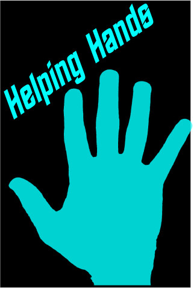
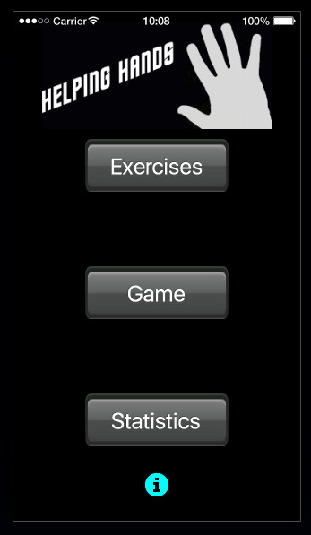
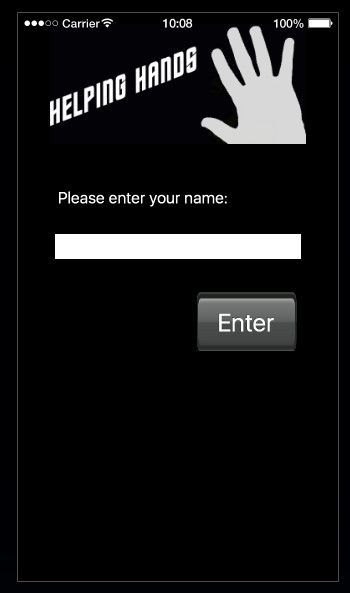
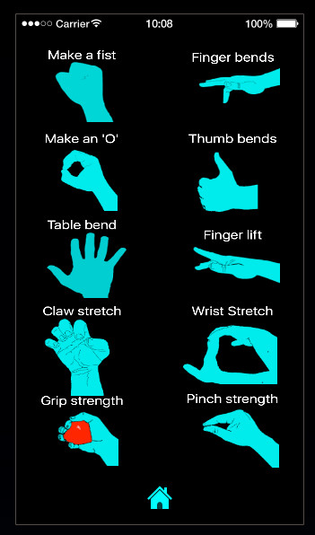
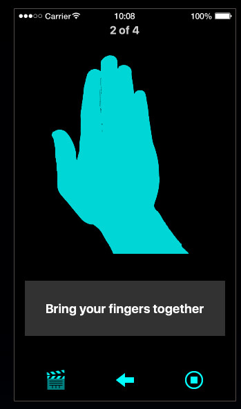
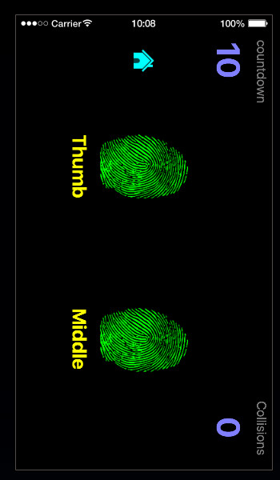
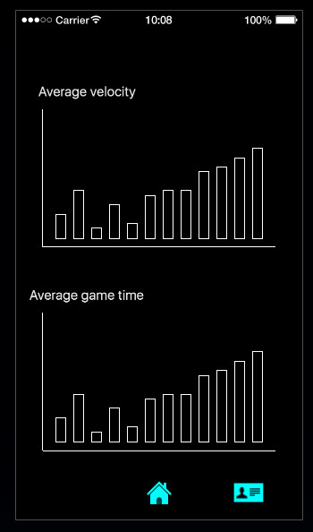

# Helping Hands

  

    
    
    
    
    
    
    
  

A mobile rehabilitation app designed to support post-surgery orthopedic recovery through interactive exercises and motion tracking.

## Overview

Helping Hands is a specialized rehabilitation application developed in Lua using Corona SDK. Created in collaboration with medical professionals, the app transforms traditional paper-based recovery instructions into an engaging digital experience with progress tracking capabilities.

## Features

- **Interactive Exercise Library**: Comprehensive collection of hand rehabilitation exercises
- **Motion Tracking**: Real-time finger movement tracking to measure recovery progress
- **Progress Dashboard**: Visual representation of recovery metrics over time
- **Game-Based Therapy**: Engaging activities designed to motivate consistent exercise
- **Secure Data Collection**: Optional sharing of recovery data with healthcare providers

## Technical Details

- **Platform**: Android
- **Language**: Lua
- **Framework**: Corona SDK
- **Data Management**: Secure cloud storage for recovery metrics
- **Connectivity**: Optional data sharing with healthcare providers

## Development Story

This application was developed to address the gap between prescribed rehabilitation exercises and patient compliance. By transforming traditional paper handouts into an interactive digital experience, Helping Hands improves the rehabilitation process in several ways:

1. **Increased Engagement**: Gamification elements encourage consistent exercise
2. **Better Monitoring**: Digital tracking provides accurate progress assessment
3. **Improved Communication**: Simplified data sharing between patients and providers
4. **Personalized Recovery**: Adaptable exercise routines based on progress

## Future Development

- iOS version
- Integration with wearable devices
- Expanded exercise library for additional recovery needs
- Telehealth consultation features

## Installation

The app is currently available for Android devices. Due to the specialized nature of the application, it is primarily distributed through healthcare providers.

## Acknowledgements

Special thanks to the orthopedic consultants who collaborated on this project, providing invaluable insights into the rehabilitation process and patient needs.

---

*Note: This project was developed as part of a healthcare initiative to improve post-operative recovery outcomes.*
